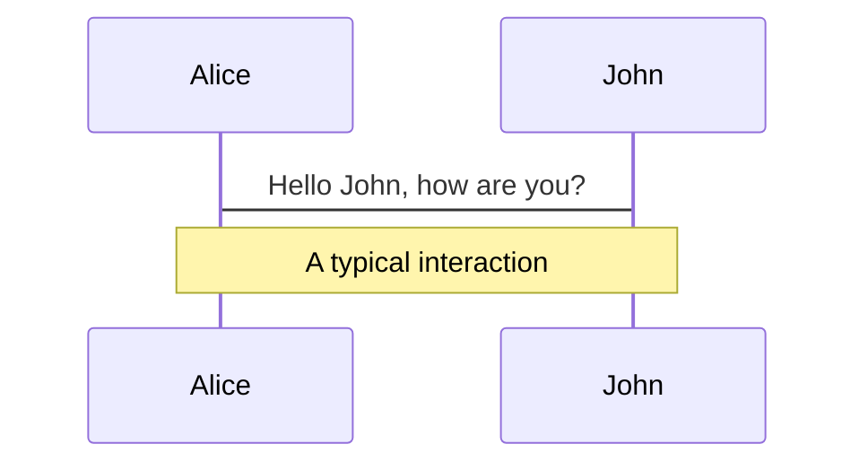
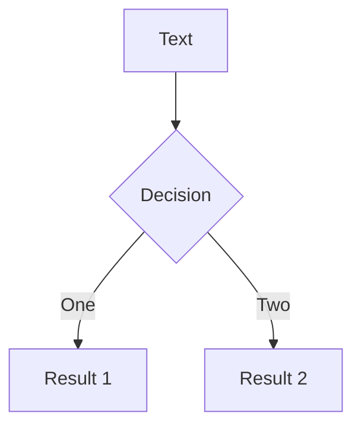
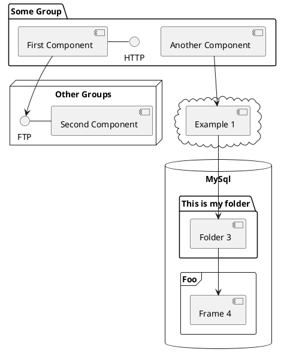

---
# try also 'default' to start simple
#theme: default
theme: seriph
# random image from a curated Unsplash collection by Anthony
# like them? see https://unsplash.com/collections/94734566/slidev
background: https://source.unsplash.com/collection/94734566/1920x1080
# apply any windi css classes to the current slide
class: 'text-center'
# https://sli.dev/custom/highlighters.html
highlighter: shiki
# show line numbers in code blocks
lineNumbers: true
# some information about the slides, markdown enabled
info: |
    ## CDD & MF
    Prezentace pro Media Factory team.

    Learn more at [Sli.dev](https://sli.dev)
# persist drawings in exports and build
drawings:
    persist: false
# use UnoCSS (experimental)
css: unocss
---

# Component Driven Development

<v-click>

## A Moderní přístup k vývoji **větších** webových aplikací

</v-click>

---

# Component Driven Development


---

# Úrovně Komponent

Na jakých úrovních můžeme uplatnit komponentární přístup ?

<v-click>

- Organizace kódu, balíčky
- UI komponenty
- <s>Služby (microservices)</s>
- <s>Mikrofrontendy</s>

</v-click>

<!-- notes: UI komponenty jsou součástí balíčků, které jsou součástí organizace kódu-->

---


---

# Proč Komponenty ?

<v-click>

- **Znovupoužívání kódu** - vývojáři mohou používat již existující komponenty. Komponenty mohou být sdíleny mezi různými aplikacemi.

</v-click>

<v-click>

- **Zjednodušení vývoje** - vývojáři se mohou soustředit na jednu část aplikace, lepší focus

</v-click>

<v-click>

- **Zrychlení vývoje** - vývojáři mohou pracovat paralelně

</v-click>

<v-click>

- **Snadnější testování** - vývojáři mohou testovat jednotlivé komponenty v izolaci.

</v-click>

<v-click>

- **Snadnější integrace** - vývojáři mohou vytvářet komponenty bez nutnosti znát celý systém

</v-click>

<v-click>

- **Snadnější udržování** - vývojáři mohou měnit a refaktorovat jednotlivé komponenty bez nutnosti znát celý systém

</v-click>

---
layout: image-left
image: /images/sitecore-monorepo.png
---

# Komponenty & Organizace kódu

<v-click>

- Modulární organizace kódu. Vytváření malých jednoúčelových balíčků.

</v-click>

<v-click>

- Monorepo - spojení balíčků do větších celků.

</v-click>

<!-- NA obrázku příklad monorepo organizace kódu -->

---

# Monorepo

- **Monorepo ≠ Monolithic repo**
- Kolokace menších balíčků uvnitř jednoho repozitáře.
- Balíčky můžou být vyvíjeny i distribuovány samostatně.
- Balíčky v monorepu mají jasně definované závislosti.
- Jasně definované task pipelines a orchestration (lint, test, dev, build, deploy, ...)

- viz: <https://monorepo.tools/>

---


---

# Monorepo Tools pro Frontend

- <s>Lerna</s>
- Workspaces (Yarn, NPM, **PNPM**) - package management.
- Orchestrace tasků - **TurboRepo**, NX, Rush, ...
- Publikování - **Changesets**

---

# Jak nám pomůže PNPM ?

- <https://pnpm.io/>
- Pohodlný package management
- Řešení některých problémů s NPM/Yarn Classic (indirect (phantom) dependencies, npm doppelgangers - duplicitní balíčky)
- auto instalace peer dependencies
- rychlejší instalace oproti npm nebo Yarn Classic
- jednoduché nastavení v porovnání s Yarn Berry

---

# Nevýhoda PNPM

- špatně napsané balíčky mohou způsobit problémy (Storybook < 7, Strapi CMS < 4.7.2, ...)

---

# Jak nám pomůže TurboRepo ?

- <https://turbo.build/>
- Orchestrace tasků
- Jednoduché nastavení
- Cache pro rychlejší buildy (lokální by default)
- Remote cache (Vercel placené řešení nebo vlastní implementace viz. <https://github.com/ducktors/turborepo-remote-cache>)

---


---


---


---


---

# Modulární kód = Udržovatelný kód

---

```json
{
  "devDependencies": {
      "@media-factory-cz/browserslist-config": "^0",
      "@media-factory-cz/eslint-config": "^1",
      "@media-factory-cz/eslint-config-react": "^1",
      "@media-factory-cz/prettier-config": "^1",
      "@media-factory-cz/stylelint-config": "^1",
      "@media-factory-cz/typescript-config": "^1",
      "@types/node": "^18",
      "@typescript-eslint/eslint-plugin": "^5",
      "@typescript-eslint/parser": "^5",
      "eslint": "^8",
      "eslint-config-prettier": "^8",
      "eslint-import-resolver-typescript": "^3.5.3",
      "eslint-plugin-import": "^2",
      "eslint-plugin-jest": "^27.2.1",
      "eslint-plugin-jsx-a11y": "^6",
      "eslint-plugin-react": "^7",
      "eslint-plugin-react-hooks": "^4",
      "eslint-plugin-testing-library": "^5",
      "postcss": "^8.4.18",
      "prettier": "^2",
      "stylelint": "^14",
      "stylelint-config-prettier": "^9",
      "stylelint-config-standard-scss": "^5",
      "typescript": "^4"
  },
}
```

---

```json
  "devDependencies": {
    "@media-factory-cz/prettier-config": "^1.0.3",
    "@types/node": "^18.14.0",
    "prettier": "^2.8.4"
  },
  "dependencies": {
    "turbo": "^1.8.2"
  }
```

---

# Komponenty v UI vývoji a designu

Proč modulární UI?
- Izolace stavu a logiky

---

Slidev is a slides maker and presenter designed for developers, consist of the following features

- 📝 **Text-based** - focus on the content with Markdown, and then style them later
- 🎨 **Themable** - theme can be shared and used with npm packages
- 🧑‍💻 **Developer Friendly** - code highlighting, live coding with autocompletion
- 🤹 **Interactive** - embedding Vue components to enhance your expressions
- 🎥 **Recording** - built-in recording and camera view
- 📤 **Portable** - export into PDF, PNGs, or even a hostable SPA
- 🛠 **Hackable** - anything possible on a webpage

<br>
<br>

Read more about [Why Slidev?](https://sli.dev/guide/why)

<!--
You can have `style` tag in markdown to override the style for the current page.
Learn more: https://sli.dev/guide/syntax#embedded-styles
-->

<style>
h1 {
  background-color: #2B90B6;
  background-image: linear-gradient(45deg, #4EC5D4 10%, #146b8c 20%);
  background-size: 100%;
  -webkit-background-clip: text;
  -moz-background-clip: text;
  -webkit-text-fill-color: transparent;
  -moz-text-fill-color: transparent;
}
</style>

---

# Navigation

Hover on the bottom-left corner to see the navigation's controls panel, [learn more](https://sli.dev/guide/navigation.html)

### Keyboard Shortcuts

|                                                    |                             |
| -------------------------------------------------- | --------------------------- |
| <kbd>right</kbd> / <kbd>space</kbd>                | next animation or slide     |
| <kbd>left</kbd> / <kbd>shift</kbd><kbd>space</kbd> | previous animation or slide |
| <kbd>up</kbd>                                      | previous slide              |
| <kbd>down</kbd>                                    | next slide                  |

<!-- https://sli.dev/guide/animations.html#click-animations -->


<p v-after class="absolute bottom-23 left-45 opacity-30 transform -rotate-10">Here!</p>

---

layout: image-right
image: <https://source.unsplash.com/collection/94734566/1920x1080>

---

# Code

Use code snippets and get the highlighting directly![^1]

```ts {all|2|1-6|9|all}
interface User {
    id: number;
    firstName: string;
    lastName: string;
    role: string;
}

function updateUser(id: number, update: User) {
    const user = getUser(id);
    const newUser = { ...user, ...update };
    saveUser(id, newUser);
}
```

<arrow v-click="3" x1="400" y1="420" x2="230" y2="330" color="#564" width="3" arrowSize="1" />

[^1]: [Learn More](https://sli.dev/guide/syntax.html#line-highlighting)

<style>
.footnotes-sep {
  @apply mt-20 opacity-10;
}
.footnotes {
  @apply text-sm opacity-75;
}
.footnote-backref {
  display: none;
}
</style>

---

# Components

<div grid="~ cols-2 gap-4">
<div>

You can use Vue components directly inside your slides.

We have provided a few built-in components like `<Tweet/>` and `<Youtube/>` that you can use directly. And adding your custom components is also super easy.

```html
<Counter :count="10" />
```

<!-- ./components/Counter.vue -->
<Counter :count="10" m="t-4" />

Check out [the guides](https://sli.dev/builtin/components.html) for more.

</div>
<div>

```html
<Tweet id="1390115482657726468" />
```

<Tweet id="1390115482657726468" scale="0.65" />

</div>
</div>

---

## class: px-20

# Themes

Slidev comes with powerful theming support. Themes can provide styles, layouts, components, or even configurations for tools. Switching between themes by just **one edit** in your frontmatter:

<div grid="~ cols-2 gap-2" m="-t-2">

```yaml
---
theme: default
---
```

```yaml
---
theme: seriph
---
```


</div>

Read more about [How to use a theme](https://sli.dev/themes/use.html) and
check out the [Awesome Themes Gallery](https://sli.dev/themes/gallery.html).

---

## preload: false

# Animations

Animations are powered by [@vueuse/motion](https://motion.vueuse.org/).

```html
<div v-motion :initial="{ x: -80 }" :enter="{ x: 0 }">Slidev</div>
```

<div class="w-60 relative mt-6">
  <div class="relative w-40 h-40">
    
    
    
  </div>

  <div
    class="text-5xl absolute top-14 left-40 text-[#2B90B6] -z-1"
    v-motion
    :initial="{ x: -80, opacity: 0}"
    :enter="{ x: 0, opacity: 1, transition: { delay: 2000, duration: 1000 } }">
    Slidev
  </div>
</div>

<!-- vue script setup scripts can be directly used in markdown, and will only affects current page -->
<script setup lang="ts">
const final = {
  x: 0,
  y: 0,
  rotate: 0,
  scale: 1,
  transition: {
    type: 'spring',
    damping: 10,
    stiffness: 20,
    mass: 2
  }
}
</script>

<div
  v-motion
  :initial="{ x:35, y: 40, opacity: 0}"
  :enter="{ y: 0, opacity: 1, transition: { delay: 3500 } }">

[Learn More](https://sli.dev/guide/animations.html#motion)

</div>

---

# LaTeX

LaTeX is supported out-of-box powered by [KaTeX](https://katex.org/).

<br>

Inline $\sqrt{3x-1}+(1+x)^2$

Block

$$
\begin{array}{c}

\nabla \times \vec{\mathbf{B}} -\, \frac1c\, \frac{\partial\vec{\mathbf{E}}}{\partial t} &
= \frac{4\pi}{c}\vec{\mathbf{j}}    \nabla \cdot \vec{\mathbf{E}} & = 4 \pi \rho \\

\nabla \times \vec{\mathbf{E}}\, +\, \frac1c\, \frac{\partial\vec{\mathbf{B}}}{\partial t} & = \vec{\mathbf{0}} \\

\nabla \cdot \vec{\mathbf{B}} & = 0

\end{array}
$$

<br>

[Learn more](https://sli.dev/guide/syntax#latex)

---

# Diagrams

You can create diagrams / graphs from textual descriptions, directly in your Markdown.

<div class="grid grid-cols-3 gap-10 pt-4 -mb-6">







</div>

[Learn More](https://sli.dev/guide/syntax.html#diagrams)

---

layout: center
class: text-center

---

# Learn More

[Documentations](https://sli.dev) · [GitHub](https://github.com/slidevjs/slidev) · [Showcases](https://sli.dev/showcases.html)
